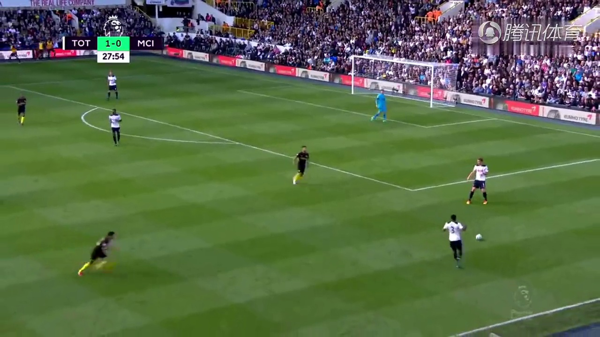
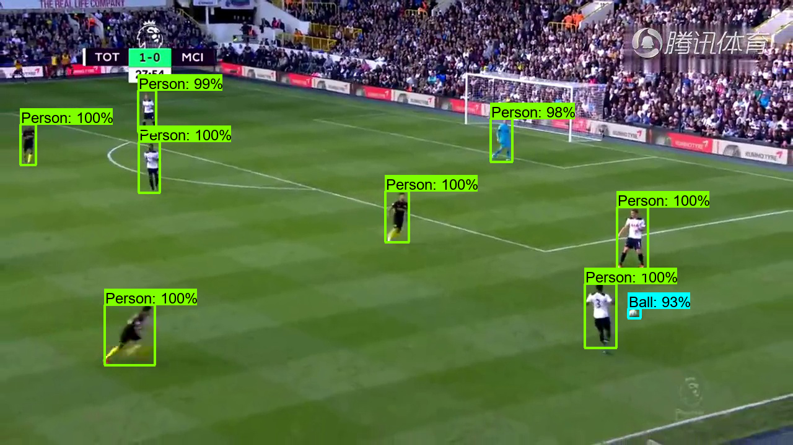

# Football Mapper
Project to create 2-d minimap representation of football (soccer) games.

Seth Mize, Lucas Franz, Bryant Cornwell

# Methods
## Overhead view base photo
Source: https://conceptdraw.com/a1992c3/preview

## Object Detection

The first task was to create a dataset by taking some images from a few football games and manually label them to train a model for object detection.
Images were labelled using "LabelImg" ([link](https://github.com/tzutalin/labelImg)) [1]. This is a tool used to manually apply bounding boxes to an input image, label them, and export a xml file that consists of box locations and associated labels for the given image. The dataset used can be found [here](documentation/data/original) and the associated xml files are [here](documentation/data/detection_images).

# Discussion
## Object Detection
### Image labeling and dataset for custom object detection model

The first task was to take some images from a few football games and manually label them to train a model for object detection.
The objects planned for detection are team A players, team B players, referees, goalies and the soccer ball. Since we are looking to detect objects from live video camera angles, much from the images in the training dataset are taken from recorded soccer games. Originally, the images were labelled by using different color bounding boxes per object category illustrated in the table below, but we ran into some difficulties when trying code, the extraction of boundary points and category label.   

| Image | Object Detection | 
| ----------------------------------------------------------------------------------- | --------------------------------------------------------------------------------------------------- | 
|  |  |
|  |  |

The images were re-labelled using "LabelImg" that provides boundary coordinates and labels for manually drawn boundary boxes. When an image has been labelled manually, the output from LabelImg is an xml file that provides the image name, image size, bounding box coordinates, and class. See the table below for an example of a manually labelled image with a corresponding dataframe of information.

| Image | Label Dateframe | 
| ----------------------------------------------------------------------------------- |--------------------------------------------------------------------------------------------------- | 
|  |  |

During the model development, a group decision was made to simplify the model to find two classes, person and ball.  

### Custom model development
#### First Approach
The next step for object detection, was to develop a model with this training dataset and apply it to some test images.

This being a first time working on object detection, I watched a video by Murtaza's Workshop on how to implement object detection ([link](https://www.youtube.com/watch?v=HXDD7-EnGBY)). This video provided insight on how to use a pre-trained model and apply it to still images and video feed.
(Write sentence about trying to code from the video after model was developed and exported.) 

After searching through some tutorials, I stumbled upon the TensorFlow 2 Object Detection API tutorial ([link](https://tensorflow-object-detection-api-tutorial.readthedocs.io/en/latest/training.html)) for training a custom object detector. The official tensorflow github models repository ([link](https://github.com/tensorflow/models)) was downloaded to prepare for building the detection model. 

A label map was created with a list of classes that match with the corresponding training dataset classes ([labels_objects.pbtxt](Bryant/TensorFlow/workspace/training_model/annotations/labels_objects.pbtxt)). See the contents below:

    item {
    name: "Person"
    id: 1
    }
    item {
    name: "Ball"
    id: 2
    }
The dataset (.xml and .png files) was separated into a 90/10 split train/test sets and stored in different folders. The generate_tfrecord.py was provided to convert the xml files for the train and test sets to train.record and test.record files. The following terminal commands are how the record files were produced for this project from the root football-mapper path:

    cd Bryant\TensorFlow
    #  Create the train record file in the annotations folder.
    python scripts\preprocessing\generate_tfrecord.py -x workspace\training_model\images\train -l workspace\training_model\annotations\labels_objects.pbtxt -o workspace\training_model\annotations\train.record
    #  Create the test record file in the annotations folder.
    python scripts\preprocessing\generate_tfrecord.py -x workspace\training_model\images\test -l workspace\training_model\annotations\labels_objects.pbtxt -o workspace\training_model\annotations\test.record
The tutorial did no go into details of generating a new custom model, but rather uses an existing pre-trained model to train a new model. Since the goal was to create a new custom model, I followed the provided [link](https://github.com/tensorflow/models/blob/master/research/object_detection/g3doc/configuring_jobs.md) to developing a config file for developing a model. This link detailed the differences between a faster-rcnn and ssd models, which the faster-rcnn model was chosen for this project due to its trend towards high accuracy in combination with the small dataset used to train the model.
Templates for config files can be found [here](Bryant/TensorFlow/models/research/object_detection/configs/tf2) and the one used for this initial attempt was the faster_rcnn_resnet50_coco.config file. In an attempt to train the model using [model_main_tf2.py](Bryant/TensorFlow/workspace/model_main_tf2.py) provided in the tensorflow git repo, running the following terminal commands and troubleshooting errors lead only to a dead-end due to the config file requiring a pre-trained model checkpoint file to generating a new model. 

    cd Bryant\TensorFlow\workspace

    python model_main_tf2.py --model_dir=models --pipeline_config_path=models/faster_rcnn_resnet50_coco.config

Checkpoint files were found for this model, but the version of the files were not supported for version 2 of the TensorFlow API. There was dated/lack of information for troubleshooting this final error, so the group decided to try another approach.

NOTE: The third approach of this model development section utilizes most of the assets of this first approach.
#### Second Approach
The source used for this approach comes from a soccer player detection and tracking research paper by Samuel Hurault, Coloma Ballester, Gloria Haro [link](https://arxiv.org/abs/2011.10336). This research paper provided their github [link](https://github.com/samuro95/Self-Supervised-Small-Soccer-Player-Detection-Tracking) and code for the research. The goal of this approach was to use one of the models from this project as a pre-trained model for the object detection model development.
The models were generated in pytorch with an .pth file extension. The "Fine-tuned Resnet50 teacher model" was downloaded and the README.md for the github was followed to test the training. Unfortunately, the goal of the source project was to retrieve an accuracy against a ground truth (Oracle model), so there was no documentation detailing the use of the model as a pre-trained model. After attempts to use it as a pre-trained model and further research, the .pth (PyTorch) model could not be loaded/utilized by familiar tools and libraries.

The source provided links to multiple soccer image datasets, which were used in testing and different sections of this project ([google drive link](https://drive.google.com/drive/folders/1dE1yzHyBOVGs4A1VlmFTq_TXOT1S5f_b?usp=sharing)).
#### Third Approach
This approach revisits the original attempt, but utilizing a pre-trained model provided by TensorFlow 2 Object Detection API tutorial and github [link](https://github.com/tensorflow/models/blob/master/research/object_detection/g3doc/tf2_detection_zoo.md).
The model downloaded was the Faster R-CNN ResNet50 V1 1024x1024 (faster_rcnn_resnet50_v1_1024x1024_coco17_tpu-8.tar) that was trained for the COCO 2017 dataset [link](http://cocodataset.org/). As determined in the first approach, the faster-rcnn model type was chosen. The COCO dataset consists of people and other objects which would beneficial for detecting at least soccer players. 
The extracted .tar file consists of a pipeline.config, checkpoint (.cpkt) files, and the saved_model.pb. The pipeline.config was copied [here](Bryant/TensorFlow/workspace/training_model/models) and the checkpoint files here copied [here](Bryant/TensorFlow/workspace/training_model/models/checkpoints). The paths for the train/test datasets and checkpoint files were added to the pipeline.config to prepare for training a new model.

To train the new model, the following terminal commands were used:
    
    cd  Bryant/TensorFlow/workspace
    #  Model_dir is where the output of the training checkpoint will be created and stored.
    python model_main_tf2.py --model_dir=training_model/models/pre-trained-models --pipeline_config_path=training_model/models/pipeline.config

There were many out of memory errors that fixed by lowering the batch_size and number of steps within the pipeline.config file. Additional software was installed to allow and implement GPU computation for training the model. The changes to the pipeline.config are detailed below as in-line comments:

    batch_size: 2  # Changed from 64.
    sync_replicas: true
    startup_delay_steps: 0
    replicas_to_aggregate: 8
    num_steps: 5000  # Changed from 10000.
    optimizer {
        momentum_optimizer: {
          learning_rate: {
            cosine_decay_learning_rate {
            learning_rate_base: .04
            total_steps: 5000  # Changed from 10000.
            warmup_learning_rate: .013333
            warmup_steps: 1000  # Changed from 2000.

Since there was a file called "checkpoint" that would be created, the checkpoint folder had to be renamed to checkpoints. The checkpoint files were eventually moved to the pre-trained-models folder negating this issue. The final error was solved by changing the checkpoint type to 'Detection' from 'Classification' within the  train_config portion of pipeline.config.

After the checkpoint files for the model are generate, the exporter_main_tf2.py provided by the tensorflow github was used to export the new trained checkpoint files to a .pb model file:

    python exporter_main_v2.py --input_type image_tensor --pipeline_config_path training_model/models/pipeline.config --trained_checkpoint_dir training_model/pre-trained-models --output_directory training_model/exported-models

When looking through documentation to load a model, I stumbled upon a few outdated methods for the first version of the TensorFlow API that halted progress for a while.
These methods consisted of transferring the model to a frozen inference graph and loading the model with cv2.dnn.readNetFromTensorflow(pb_file, pbtxt_file) and cv2.dnn_DetectionModel(pb_file, pbtxt_file) from the opencv library. The persistent error was getting the memory shapes of the data layer.

After a closer look at the TensorFlow 2 (TF2) Object Detection API tutorial, the "Examples" section provided starter code for loading a TF2 model and running it on an image. The code for this can be found in [detection.py](Bryant/detection.py). See the results section for images tested using this model.

# Results
## Object Detection
The following images were taken from the TV_Soccer dataset provided by the soccer player detection and tracking research paper by Samuel Hurault, Coloma Ballester, Gloria Haro ([google drive link](https://drive.google.com/drive/folders/1dE1yzHyBOVGs4A1VlmFTq_TXOT1S5f_b?usp=sharing)).

| Original Image | Detected Image | 
| ----------------------------------------------------------------------------------- |--------------------------------------------------------------------------------------------------- | 
|  |  |

# References
[1] LabelImg Github: https://github.com/tzutalin/labelImg

